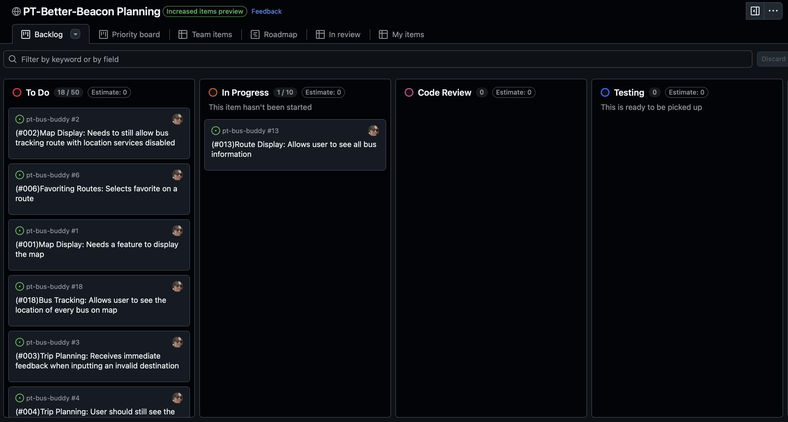
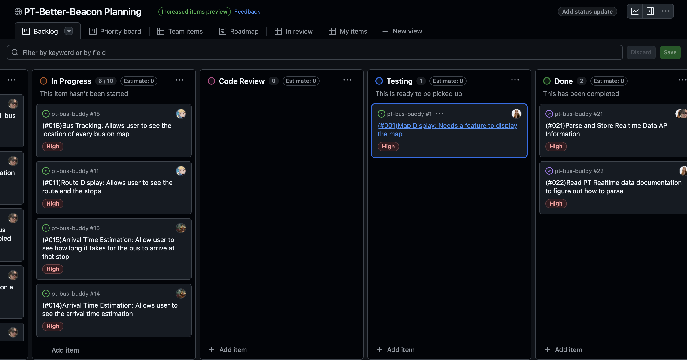

# Sprint 1 Report
NOTE by Genevieve: we need to finalize this .md file before we submit the sprint assignment.

Video Link:
## Kanban Board Progress
Kanban board before Sprint 1:

Kanban board during Sprint 1:

## What's New (User Facing)
* User is able to view the map of Pullman via the Google maps API and can see thier location and bus locations as long as location services are turned on. Additionally, users can now see bus schedules in the 'Schedules' tab.

* Completed by Darron -> (#013): Route Display: Allow users to view all bus information
* Completed by Genevieve -> (#001) Map Display: Allows user to view the main base map of Pullman and see thier location, (#022) Pullman Transit API: Read PT documentation and figure out what information is provided via the api
* Completed by Joanne -> (#020): Schedules Page: Allow users to navigate to the schedules page where bus schedules are displayed.
* Completed by Collin -> (#018): Show Bus Locations Toggle: Allow users to toggle on/off all bus locations.
* Feature n or Bug Fix n
## Work Summary (Developer Facing)
NOTE by Genevieve: we will do this when the sprint is over.

Provide a one paragraph synposis of what your team accomplished this sprint. Don't
repeat the "What's New" list of features. Instead, help the instructor understand
how you went about the work described there, any barriers you overcame, and any
significant learnings for your team.
## Unfinished Work
NOTE by Genevieve: we will probably have a lot to put here since we have 20+ issues and all of our project issues were added to this first sprint. Do
this after the inital sprint 1.

If applicable, explain the work you did not finish in this sprint. For issues/user
stories in the current sprint that have not been closed, (a) any progress toward
completion of the issues has been clearly tracked (by checking the checkboxes of
acceptance criteria), (b) a comment has been added to the issue to explain why the
issue could not be completed (e.g., "we ran out of time" or "we did not anticipate
it would be so much work"), and (c) the issue is added to a subsequent sprint, so
that it can be addressed later.

## Completed Issues/User Stories
Here are links to the issues that we completed in this sprint:
* [URL of issue 22](https://github.com/darronese/pt-bus-buddy/issues/22)
* [URL of issue 1](https://github.com/darronese/pt-bus-buddy/issues/1)
* [URL of issue 20](https://github.com/pt-bus-buddy/pt-bus-buddy/issues/20)
* [URL of issue 18](https://github.com/pt-bus-buddy/pt-bus-buddy/issues/18)
Desirables (Remove this section when you save the file):
* FINISHED - Each issue should be assigned to a milestone
* FINISHED - Each completed issue should be assigned to a pull request
* Each completed pull request should include a link to a "Before and After" video
* FINISHED - All team members who contributed to the issue should be assigned to it on
GitHub
* Each issue should be assigned story points using a label
* Story points contribution of each team member should be indicated in a comment
## Incomplete Issues/User Stories
Here are links to issues we worked on but did not complete in this sprint:
* URL of issue 1 <<One sentence explanation of why issue was not completed>>
* URL of issue 2 <<One sentence explanation of why issue was not completed>>
* URL of issue n <<One sentence explanation of why issue was not completed>>
Examples of explanations (Remove this section when you save the file):
* "We ran into a complication we did not anticipate (explain briefly)."
* "We decided that the feature did not add sufficient value for us to work on it
in this sprint (explain briefly)."
* "We could not reproduce the bug" (explain briefly).
* "We did not get to this issue because..." (explain briefly)
## Code Files for Review
Please review the following code files, which were actively developed during this
sprint, for quality:
* [Name of code file 1](https://github.com/your_repo/file_extension)
* [Name of code file 2](https://github.com/your_repo/file_extension)
* [Name of code file 3](https://github.com/your_repo/file_extension)
## Retrospective Summary
**Here's what went well:**

*everybody was able to get their assigned tasks done on time without meeting in person, due to spring break  
*we made lots of progress on the app

**Here's what we'd like to improve:**

*the communication, as it was hard to get everybody on the same page Since we were all away, we had to communicate through messages, which was difficult since a lot of us were traveling. Some of us weren’t even in the same time zone!  
*more time to meeting in person and discussing topics and what we are able to work on  
*manage more of the workload and be better productively

**Here are changes we plan to implement in the next sprint:**

*Error handling for user location services not being turned on  
*Schedule regular check-ins - By setting up a mandatory virtual check-in, we can all talk about the progress we have made and to make sure everybody is on the right track. This could also help us understand what our teammates are working on to ensure maximum productivity  
*Use a more scheduled communication tool - By setting up a more scheduled communication tool like Trello, we would be able to help everybody get on board and stay focused on their tasks. This would be extremely beneficial for someone who has to travel. They would still be able to communicate and work on their task!  
*Plan ahead for absences - Before busy breaks or weekends, we can plan the task distribution accordingly. We can assign responsibilities early and have them complete the task before a busy break or weekend to ensure that the work is done and there is no need for future clarification  
*Extensive meeting at the beggining of each sprint

  ## Retrospective Report
  Overall, our sprint 1 was successful. We were able to make significant progress on the app, implementing  a list of key features such as parsing the API data (Darron), Prompting for user location and displaying an accurate/scalable Map (Genevieve), adding a bus schedule page with accurate bus schedules (Joanne), adding static map markers at each of the bus stops (Collin), and using bus data to estimate arrival times of busses at each stop (Riley). Each of these are high priority features that are crucial to the core functionality of the app. Our team found it helpful to work on the high priority items, because most other features depend on certain core features of the app to work. For future sprints, we need to take the time to better understand the directions, and discuss our team’s vision for what the app/features will look like before starting the sprint. We also need better communication as to who is assigned to which task, and to hash out any potential issues where certain features rely on the completion of other features. To improve our sprint process, our team decided to have virtual meetings where each person discusses their progress on a feature or any potential problems. We can use a concrete scheduling app such as trello in order to coordinate times and ensure everyone can make them. We will also assign tasks earlier on in the sprint (or before breaks/weekends) so that everyone knows what they need to work on. Lastly, we will have a meeting at the start of each sprint to go over the directions (deliverables) of the sprint, our team’s overall vision for the app (what will the app look like by the end of the sprint), and assign tasks to each person (discuss which features rely on other features vs which features can be worked on independently). This will also help us to get a head start on the sprint, and stay on top of the time frame which we have to complete the sprint.
