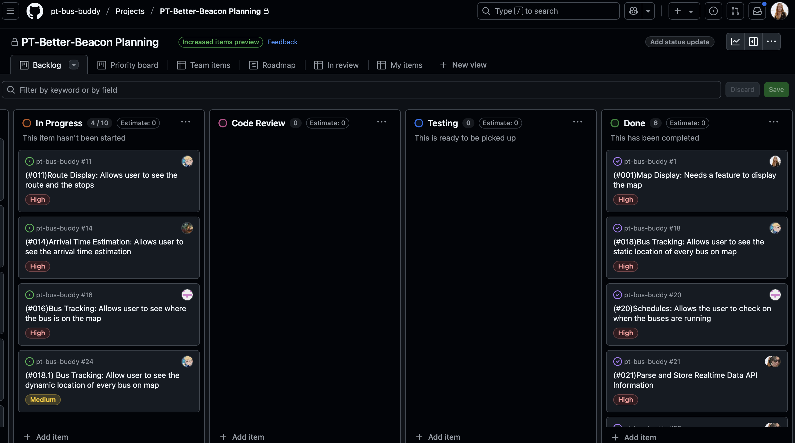
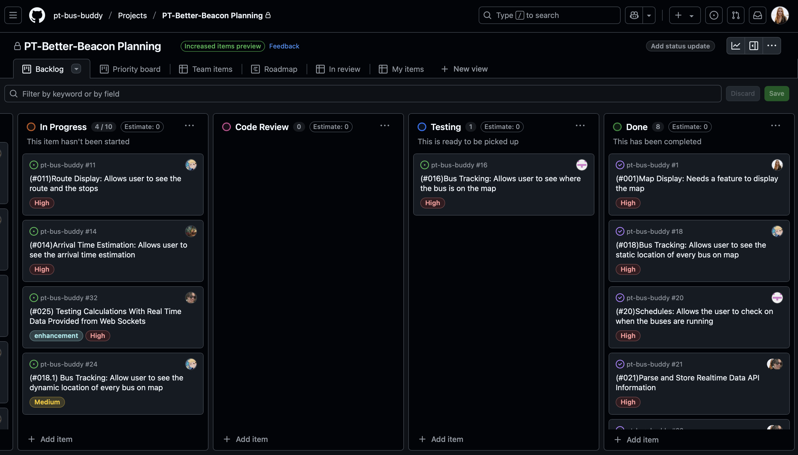

# Sprint 2 Report
Video Link:

# Kanban Board Progress
Before Sprint 2:

In the Middle of Sprint 2:

After Sprint 2:

## What's New (User Facing)
* (#023) Assigned to: Genevieve - Add Ability to View List of Routes From Dropdown Menu
* (#004) Assigned to: Genevieve - Add Error Checking for Zooming to User Location Without Location Services
* (#018.1) Assigned to: Joanne - Add Ability to Track Buses on Map
* (#011) Assigned to: Collin - Add Route Display
* (#016) Assigned to: Collin - Allow Users to Pick Individual Buses on Map

## Work Summary (Developer Facing)
The team worked hard this sprint to finish much of the essential user-facing features. Having wrapped up the bus display, route display, and associated buttons and toggles, we can begin to focus on quality of life specific updates in sprint 3. This sprint was difficult as it focused primarily on socket-based function. Between the socket-based work and the data parsing necessary to gather stop data, additional files were necessary that took care of said functions. All in all, despite these features being a moderate amount of work, the added data and socket work created a hefty workload for the team to manage. Meetings this sprint were productive, and the team did a good job of keeping open communication on the status of their work. Overall, this sprint went pretty smoothly, and next sprint should benefit as a result.

## Unfinished Work
Not applicable/no unfinished work for Sprint 2.

## Completed Issues/User Stories
Here are links to the issues that we completed in this sprint:
* [Link to issue 023](https://github.com/orgs/pt-bus-buddy/projects/2/views/1?pane=issue&itemId=102922992&issue=pt-bus-buddy%7Cpt-bus-buddy%7C30)
* [Link to issue 004](https://github.com/orgs/pt-bus-buddy/projects/2?pane=issue&itemId=102425732&issue=pt-bus-buddy%7Cpt-bus-buddy%7C4)
* [Link to issue 018.1](https://github.com/orgs/pt-bus-buddy/projects/2/views/1?pane=issue&itemId=102425748&issue=pt-bus-buddy%7Cpt-bus-buddy%7C16)
* [Link to issue 011](https://github.com/orgs/pt-bus-buddy/projects/2?pane=issue&itemId=102425741&issue=pt-bus-buddy%7Cpt-bus-buddy%7C11)
* [Link to issue 016](https://github.com/orgs/pt-bus-buddy/projects/2?pane=issue&itemId=102425748&issue=pt-bus-buddy%7Cpt-bus-buddy%7C16)

## Code Files for Review
Please review the following code files, which were actively developed during this
sprint, for quality:
* [client/App.js](https://github.com/pt-bus-buddy/pt-bus-buddy/blob/main/client/App.js)
* [client/ShowBusToggle.js](https://github.com/pt-bus-buddy/pt-bus-buddy/blob/main/client/ShowBusToggle.js)
* [client/RouteSelector](https://github.com/pt-bus-buddy/pt-bus-buddy/blob/main/client/RouteSelector.js)

## Retrospective Summary
#Here's what went well:
* Communication 
* Got a large number of issues done in this sprint
* Got much of our user-facing issues done
#Here's what we'd like to improve:
* Evenly spacing work throughout the Sprint
* Making regimented PR's
#Here are changes we plan to implement in the next sprint:
* Breaking work into smaller chunks
* Not cramming work into the end of the sprint
* Meeting more consistently and discussing status
